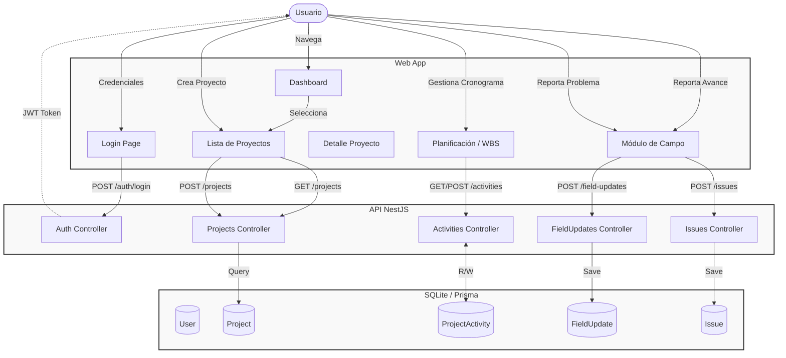
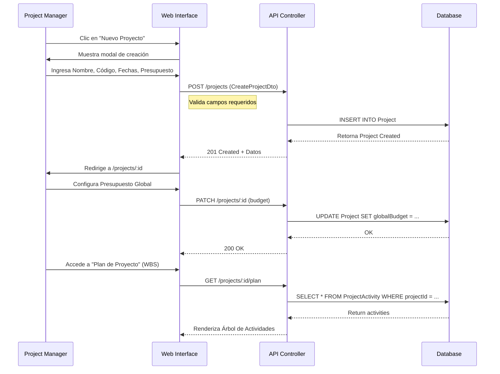
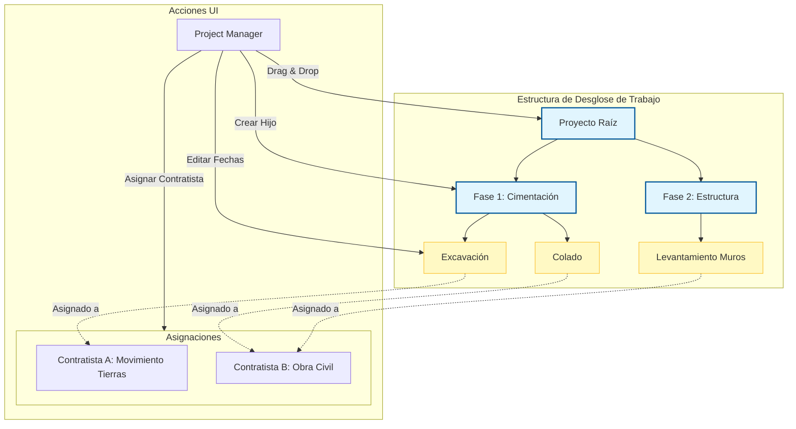
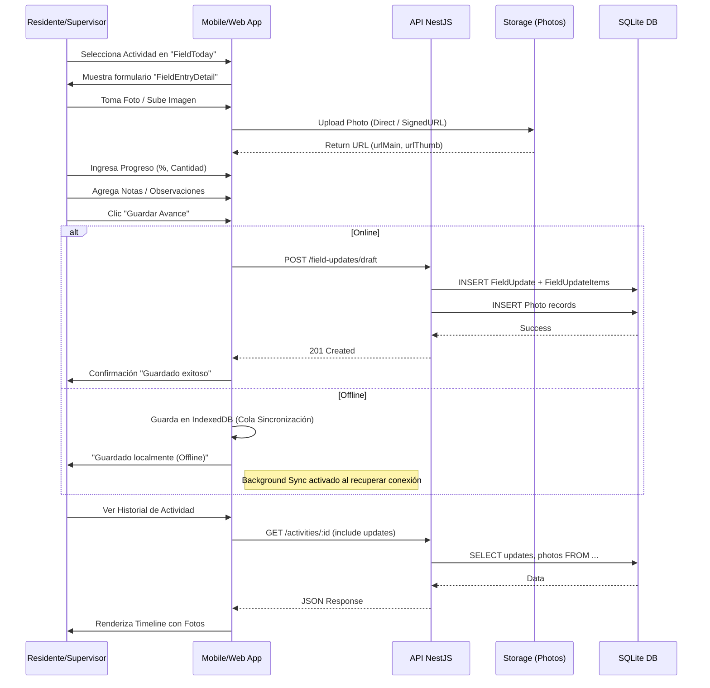
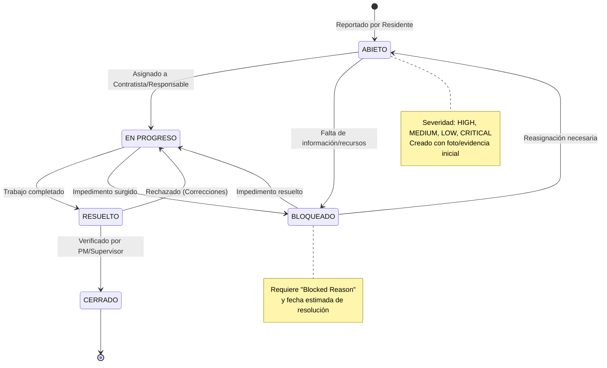

# Documentación de Flujos (Mermaid)

Este directorio contiene diagramas Mermaid (`.mmd`) que ilustran la arquitectura, flujos de usuario y procesos clave del sistema.

## Índice de Diagramas

### 1. [Overview General](./01-overview.mmd)
Muestra la arquitectura de alto nivel: interacción entre Usuario, Frontend (Web/Mobile), API NestJS y Base de Datos.


### 2. [Gestión de Proyectos](./02-proyectos.mmd)
Secuencia de creación y configuración inicial de un proyecto (Presupuesto, Fechas).


### 3. [WBS y Actividades](./03-actividades.mmd)
Estructura jerárquica de actividades y asignación de contratistas.


### 4. [Evidencia de Campo](./04-evidencia.mmd)
Flujo de reporte de avance desde campo (App móvil/web), soporte offline y carga de fotos.


### 5. [Ciclo de vida de Issues](./05-punchlist.mmd)
Estados y transiciones de problemas (Punchlist).


### 6. [Roles y Permisos](./06-roles.mmd)
Matriz de acceso por rol (Admin, PM, Usuario, Contratista).
```mermaid
graph TD
    subgraph Auth [Autenticación]
        Login[Pantalla Login] -- Credenciales --> API_Auth[POST /auth/login]
        API_Auth -- Valida --> DB_User[(Tabla User)]
        DB_User -- Retorna Role + TenantId --> API_Auth
        API_Auth -- Token JWT --> Client[Cliente Web]
    end

    subgraph Roles [Roles y Permisos]
        Admin((Administrador))
        PM((Project Manager))
        User((Usuario Estandar / Residente))
        Contractor((Contratista / Portal))
        
        Admin -->|Full Access| Config[Configuración Tenant]
        Admin -->|Gestiona| Users[Usuarios y Contratistas]
        
        PM -->|Gestiona| Projects[Proyectos y Presupuestos]
        PM -->|Aprueba| Estimates[Estimaciones de Pago]
        
        User -->|Registra| DailyLog[Bitácora Diaria]
        User -->|Reporta| Issues[Problemas en Campo]
        User -.->|Solo Lectura| Budget[Presupuesto (Limitado)]
        
        Contractor -->|Acceso Portal| Portal[Portal de Proveedores]
        Portal -->|Visualiza| RFI[RFIs y RFQs]
        Portal -->|Carga| Invoices[Facturas]
    end
    
    Client -->|Bearer Token| ProtectedRoutes{Rutas Protegidas}
    ProtectedRoutes -- Role Check --> View[Vista Permitida]
    
    %% Styling
    classDef role fill:#fce4ec,stroke:#880e4f,stroke-width:2px;
    class Admin,PM,User,Contractor role;
```

## Cómo ver los diagramas

1. **GitHub / GitLab**: Los archivos `.mmd` y este `README.md` se renderizan automáticamente.
2. **VS Code**: Instala la extensión **"Mermaid Preview"** o **"Markdown Preview Mermaid Support"**.

## Exportar a Imágenes (PNG/SVG)

Se incluye un script utilitario para exportar todos los diagramas a imágenes usando `mmdc` (Mermaid CLI) vía `npx`. No requiere instalar dependencias globales.

### Requisitos
- Node.js instalado
- Acceso a internet (para descargar `mermaid-cli` la primera vez)

### Uso
Desde la raíz del proyecto:

```bash
# Dar permisos de ejecución (solo la primera vez)
chmod +x docs/flows/export-diagrams.sh

# Ejecutar script
./docs/flows/export-diagrams.sh
```

Esto generará archivos `.png` en la misma carpeta `docs/flows/`.
